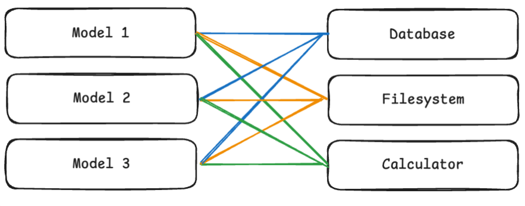
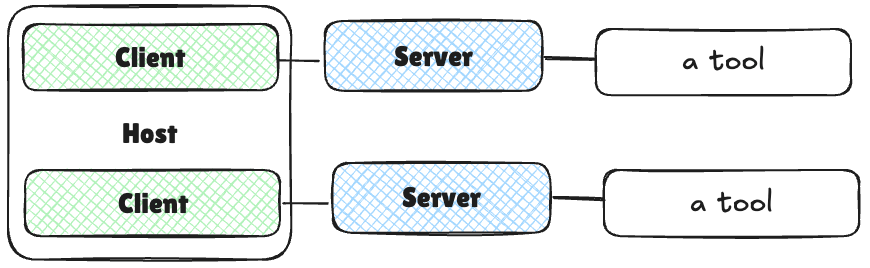

# 知识学习

## 为什么需要mcp

MCP（Model Context Protocol）是一个协议规范，是对模型、client、server 三者之间如何通信的统一协议

如果没有类似 MCP 的协议，我们将需要创建 M×N 个自定义集成——为 AI 应用与外部能力的每一种可能组合创建一个（使用function-calling）。


计算机领域的任何问题都可以通过增加一个间接的中间层来解决

这里加一个mcp-host作为中间层，形成这样的结构



有了mcp-host 就降低了对模型的要求，模型可以不支持function-calling，只需要有很强的逻辑执行能力就可以了，模型只需要理解 MCP 格式的 prompt/响应协议，并基于文本（或结构化 JSON）逻辑执行任务，不需要真正调用函数，而工具客户端的调用由MCPClient执行

其中**mcp-host** 常见的就是cursor、Claude 、Cherry-studio（~~更适合国内使用~~）里面封装了**mcp-client**的逻辑，可以通过json配置client和mcp-server的连接


## 通信协议

MCP 定义了一个标准化的通信协议，使客户端和服务器能够以一致、可预测的方式交换消息。这种标准化对于社区间的互操作性至关重要。

### Json-rpc

下面是json-rpc的结构

#### 1. 请求

* 一个唯一标识符（ `id` ）

* 要调用的方法名（例如， `tools/call` ）

* 该方法参数（如有）

* 示例

```json
{
  "jsonrpc": "2.0",
  "id": 1,
  "method": "tools/call",
  "params": {
    "name": "weather",
    "arguments": {
      "location": "San Francisco"
    }
  }
}
```

#### 2. 响应

从服务器发送给客户端以回复请求。响应消息包括：

* 与相应请求相同的 `id`

* `result` （成功）或 `error` （失败）

成功响应：

```json
{
  "jsonrpc": "2.0",
  "id": 1,
  "result": {
    "temperature": 62,
    "conditions": "Partly cloudy"
  }
}
```

失败响应：

```json
{
  "jsonrpc": "2.0",
  "id": 1,
  "error": {
    "code": -32602,
    "message": "Invalid location parameter"
  }
}
```

#### 3. 通知

单向消息，无需回复。通常由服务器发送给客户端，以提供有关事件的更新或通知。

```json
{
  "jsonrpc": "2.0",
  "method": "progress",
  "params": {
    "message": "Processing data...",
    "percent": 50
  }
}
```

### 传输机制

#### Stdio （标准输入/输出）

stdio 传输用于本地通信，即客户端和服务器运行在同一台机器上：

* 主机应用程序作为子进程启动服务器，并通过向其标准输入（stdin）写入以及从其标准输出（stdout）读取来与其通信。


#### HTTP + SSE (服务器发送事件) / 可流式传输的 HTTP

HTTP+SSE 传输用于远程通信，客户端和服务器可能位于不同的机器上：


这里贴一个npm包，可以实现stdio和sse的互相转换

> Supergateway可以通过一条命令在SSE（服务器端事件）或WebSockets（WS）上运行基于MCP stdio的服务器。这对于远程访问、调试或连接到仅支持stdio的MCP服务器上的客户端非常有用。

mcp目前提供了三种方式的服务 stdio、sse 、streamable-http

下面快速介绍一下这三种方式的区别

* mcp-server目前有两种形式，一种是对外直接提供服务的，可以直接通过sse的url进行通信，另一种是需要本地启动服务的，通过stdio或者发布成服务进行开放

* 在modelscope可以通过查看mcp后面的hosted（为直接提供服务的）和local（需要本地部署）

# 1. 环境要求

* 如果要下载第三方提供的mcp服务建议安装

- [ ] 安装node.js&#x20;

- [ ] 安装uvx

选择使用客户端的方式进行测试，下载[Cherry Studio](https://cherrystudiocn.com/)

# 2. 配置

在下面的模型服务中添加自己的平台及api-key


进行mcp-server配置


导入下面的json

```json
{
  "mcpServers": {
    "filesystem": {
      "name": "filesystem",
      "type": "stdio",
      "isActive": true,
      "registryUrl": "",
      "command": "npx",
      "args": [
        "-y",
        "@modelcontextprotocol/server-filesystem",
        "D:\\download\\test"
      ]
    }
  }
}
```

上面参数是在本地通过node启动了一个本地服务

开启mcp服务器（上面服务采用默认的stdio通信，即本地进程通信）

在对话的设置中的助手设置开启模型的mcp服务


# 3. 测试


# 4. 编写mcp-server

```bash
# 下载fastmcp
pip install fastmcp
```

代码如下

```python
from pathlib import Path
from fastmcp import Context
from fastmcp import FastMCP,Client
import asyncio
mcp = FastMCP("getPersonInfo",port=8888)
import pandas as pd
from fastmcp.resources import *
@mcp.tool()
def getPersonInfo(ctx: Context | None = None) ->str|None:
    """返回所有的人员的个人信息（返回Markdown）
    输入：无
    输出：md_tabel (输出所有的人员的个人信息（markdown表格形式)
    """
    path=r"D:\pycharm\mcp\demo1\person.xlsx"
    df = pd.read_excel(path)
    md_table = df.to_markdown()  # 不保留行索引
    return md_table
@mcp.tool()
def getOrderInfo(ctx: Context | None = None) ->str|None:
    """返回所有的菜品的相关信息（返回Markdown）
    输入：无
    输出：md_tabel (输出所有的菜的信息（markdown表格形式)
    """
    path=r"D:\pycharm\mcp\demo1\order.xlsx"
    df = pd.read_excel(path)
    md_table = df.to_markdown()  # 不保留行索引
    return md_table
def main():
    mcp.run()

if __name__ == "__main__":
   #mcp.run()
    mcp.run(transport='streamable-http')
```

运行上面代码并通过[ngork](https://dashboard.ngrok.com/)开放到公网

```bash
python demo.py
ngrok http http://localhost:8888
```

# 5. 使用dify测试

在dify中选择agent支持mcp的策略

mcp配置如下

```json
{
  "getPersonInfo": {
    "transport": "streamable_http",
"headers": {"Content-Type": "application/json"}, 
    "url": "https://c6e6-49-74-111-140.ngrok-free.app/mcp/"
  }
}
```

dify在新版本中对Streamable HTTP通信增加了对响应的headers中Content-Type的判断，否则无法确定返回的响应是json字符串还是event字符串

添加了请求体的类型仍有报错如下


fastmcp的sdk导致的


将url改为/mcp/


进行测试


> 新版本的dify 添加了对mcp的resource 和template的支持（未测试）

# PS:MCP（需要local运行并且运行模式为stdio）转为sse/http

很多平台提供了众多mcp-server，我们使用npm/uv 运行，但是部分只支持stdio，这样我们的一些平台就不能使用我们的mcp（如dify），这里可以使用supergate 转化一下

[文件系统](https://www.modelscope.cn/mcp/servers/@modelcontextprotocol/filesystem) 这是一个local mcp&#x20;

```json
{
  "mcpServers": {
    "filesystem": {
      "command": "npx",
      "args": [
        "-y",
        "@modelcontextprotocol/server-filesystem",
        "/Users/username/Desktop",
        "/path/to/other/allowed/dir"
      ]
    }
  }
}
```

这是他提供的 启动配置

我们可以通过下面方式使其通过sse 方式启动（[supergateway](https://github.com/supercorp-ai/supergateway#readme) 启动）

```bash
npx -y supergateway     --stdio "npx -y @modelcontextprotocol/server-filesystem  D:\gemini-cli\test"     --port 8000     --ssePath /sse
```

只需要根据需要更改引号内的mcp 服务即可


sse的节点在`http://localhost:8000/sse`

之后进行内网穿透即可

